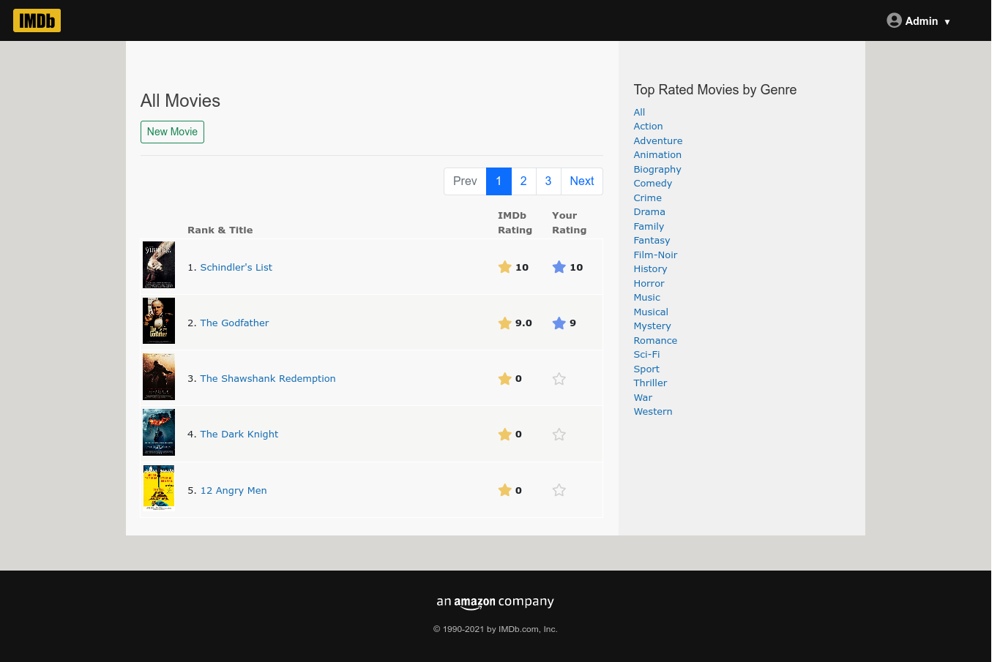
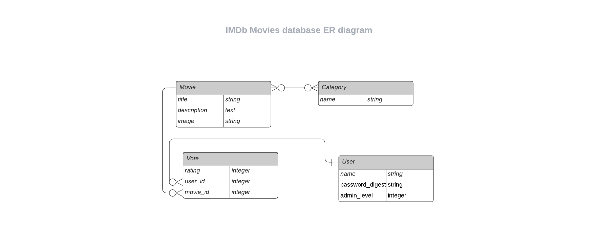

#  IMDb Clone

  Full-stack Rails application listing Movies with their details.
  It has a true encrypted authentication system and a few functionalities provided in the admin panel (CRUD operations on items). 
  As a user, you can filter Movies by genre and give your own rating for each of them. To rate a movie you must be registered and signed in first.

  This is a desktop web application and not supposed for small screen devices (any viewport width less than __768px__)

  All design and functionality ideas (and contents) are cloned and belongs to [IMDb.com, Inc.](https://www.imdb.com/)
  

## Built With 

- Rails 6.1
- Webpacker
- ES6
- RSpec
- Bootstrap

## Screenshots

## ER Diagram

## Live Demo

[Heroku](https://imdb555.herokuapp.com/)

## Setup

  If you want to try this application locally, follow the steps below:

  1. Clone the project using `git clone git@github.com:8Bts/imdb_clone.git` command.

  2. run `cd imdb_clone` to enter the folder.

  3. run `bundle install && yarn install` to install dependencies.

  4. run `rails db:migrate` to initialize local databases.

  5. run `rails server` to start local server

## Test

  To run tests for the application try the `rspec` command and ensure that you are in the project folder before running it. 

## Author

👤 **Rashid Mammadli**

- Github: [8Bts](https://github.com/8Bts)
- Twitter: [@Rasheed49705929](https://twitter.com/Rasheed49705929)
- Linkedin: [Rashid Mammadli](https://www.linkedin.com/in/rashidmammadli/)
- Email: mcmizze@yahoo.com

## 🤝 Contributing

Contributions, issues, and feature requests are welcome!

Feel free to check the <a href="https://github.com/8Bts/imdb_clone/issues" target="_blank">issues page</a>.

## Show your support

Give a ⭐️ if you like this project!

## Acknowledgments

- [Microverse - Web Development School](https://www.microverse.org/)
